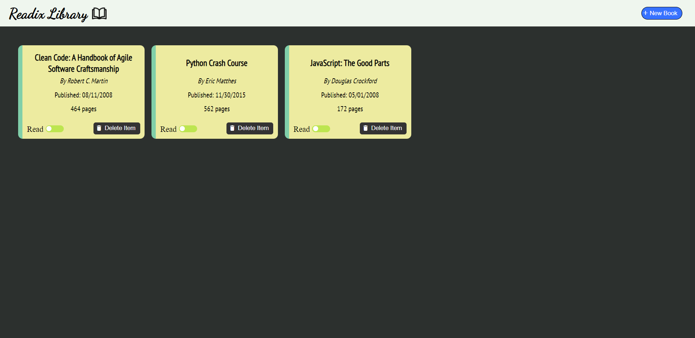
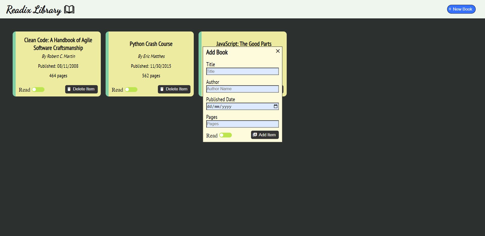

# Library

[**Readix Library**](https://rainierxcode.github.io/Library/) currently offers a user-friendly platform for organizing your favorite books with an intuitive interface. While it doesn't have a database yet, plans include implementing one and adding a description box for each book, enhancing the user experience for book enthusiasts looking to curate and track their literary favorites more comprehensively.

## Sample Screenshots

